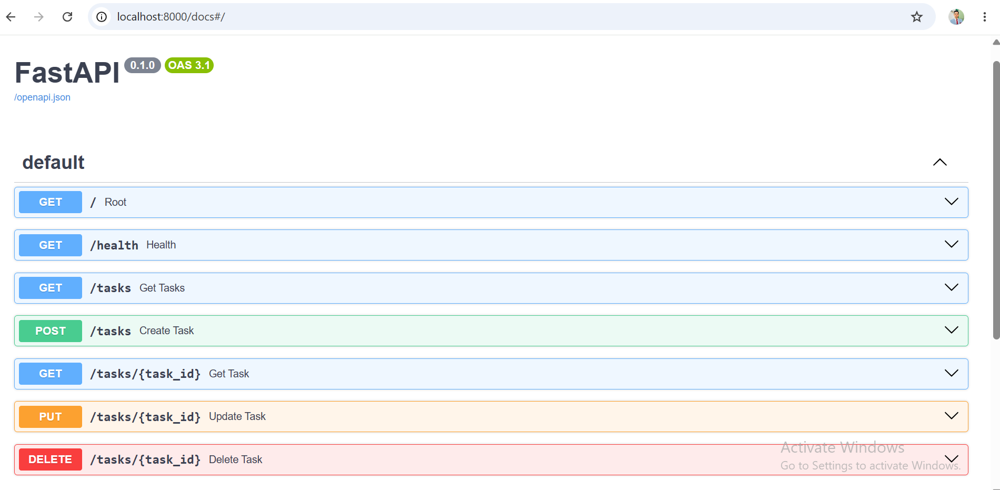

# FlyRank AI Internship — Week 2 Assignment 1

## Build Your First CRUD API

A beginner backend project developed during the **FlyRank AI Internship (Backend AI Track)**.

This project implements a Task Management API using **Python FastAPI** and demonstrates the fundamentals of backend development:

* API endpoints
* HTTP methods
* CRUD operations
* Request validation
* Status codes
* Swagger API documentation
* Git and GitHub workflow

---

## Tech Stack

* Python 3.10+
* FastAPI
* Uvicorn
* Pydantic
* Swagger UI
* Git & GitHub

---

## Project Features

The API supports complete CRUD functionality:

* Create tasks
* Read tasks
* Update tasks
* Delete tasks

The data is stored using an in-memory list (no database), as required by the assignment.

---

## Installation

Clone the repository:

```bash
git clone https://github.com/zain-nadeem1/flyrank-week2-crud-api
```

Move into the project folder:

```bash
cd flyrank-week2-crud-api
```

Create and activate virtual environment:

```bash
python -m venv venv
```

Windows:

```bash
venv\Scripts\activate
```

Install dependencies:

```bash
pip install -r requirements.txt
```

---

## Run the API

Start the server:

```bash
uvicorn main:app --reload
```

The API will run at:

```
http://127.0.0.1:8000
```

---

## Swagger Documentation

FastAPI automatically provides interactive documentation.

Open:

```
http://127.0.0.1:8000/docs
```

Swagger UI allows testing all API endpoints without using external tools.



---

## API Endpoints

| Method | Endpoint      | Description         |
| ------ | ------------- | ------------------- |
| GET    | `/`           | API information     |
| GET    | `/health`     | Server health check |
| GET    | `/tasks`      | Get all tasks       |
| GET    | `/tasks/{id}` | Get a task by ID    |
| POST   | `/tasks`      | Create a new task   |
| PUT    | `/tasks/{id}` | Update a task       |
| DELETE | `/tasks/{id}` | Delete a task       |

---

## Status Codes Implemented

| Status Code | Meaning                   |
| ----------- | ------------------------- |
| 200         | Successful request        |
| 201         | Task created              |
| 204         | Task deleted successfully |
| 400         | Invalid request data      |
| 404         | Task not found            |

---

## Example API Test

### Create Task

Request:

```bash
curl -i -X POST http://127.0.0.1:8000/tasks \
-H "Content-Type: application/json" \
-d "{\"title\":\"Learn Backend Development\"}"
```

Response:

```json
{
    "id": 4,
    "title": "Learn Backend Development",
    "done": false
}
```

---

## Learning Outcome

Through this assignment, I practiced:

* Building REST APIs with FastAPI
* Understanding request-response flow
* Implementing CRUD operations
* Validating user input
* Documenting APIs using Swagger
* Managing projects with Git and GitHub

---

## AI vs Me

For this stage, I asked an AI assistant to build the same CRUD API and compared the generated solution with my manually implemented version.

### Prompt Used

Build a Task Management REST API using Python FastAPI.
Requirements:
1. Use FastAPI framework.
2. Store tasks in an in-memory Python list only (no database).
3. Create these endpoints:
GET /
Return:
{
"name": "Task API",
"version": "1.0",
"endpoints": ["/tasks"]
}
GET /health
Return:
{
"status": "ok"
}
GET /tasks
Return all tasks.
GET /tasks/{id}
Return a single task.
If task does not exist return:
404 status code with JSON error message.
POST /tasks
Accept JSON:
{
"title": "task name"
}
Create a new task:
- Generate ID automatically
- Set done=false
- Return status code 201
Validate:
- Missing title should return 400
- Empty title should return 400
PUT /tasks/{id}
Update title and/or done status.
Invalid data returns 400.
Unknown ID returns 404.
DELETE /tasks/{id}
Delete a task.
Return status code 204.
Unknown ID returns 404.
Add Swagger documentation.
Create complete main.py code.

### What AI Did Better

- Generated code quickly.
- Added structured API documentation.
- Suggested cleaner approaches.

### What AI Got Wrong / Missed

- Some generated implementations may not exactly follow required status codes.
- Validation rules needed verification.
- Some decisions were made without being explicitly requested.

### What My Prompt Forgot

The AI highlighted that some details must be specified clearly, such as:

- Exact response formats.
- Error message format.
- Status code requirements.

### Final Reflection

Building the API manually first helped me understand and review AI-generated code instead of blindly accepting it.

## Internship Context

This project was completed as part of:

**FlyRank AI Internship**
**Backend AI Track**
**Week 2 — Assignment 1: Build Your First CRUD API**
